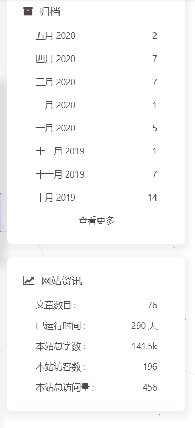

## 个人信息

 - fulsun
 - 本科 | 武汉华夏理工学院 | 计算机科学与技术
 - 工作年限：1年+
 - 技术博客：<https://blog.fulsun.top>
 - Github: <http://github.com/fulsun>
 - Email: [fl_6145@163.com](mailto:fl_6145@163.com)
 - 职位：Java开发工程师

## 开源项目和作品

### 开源项目

 - 暂时没有完整的开源项目

## 技能清单

以下均为我熟练使用的技能

- Web开发：Java/Python/Linux
- Web框架：Spring/Spring MVC/SpringBoot/SpringCloud
- 前端框架：VueJS/Bootstrap/jQuery
- 数据库相关：MySQL/Oracle
- 大数据相关：Hadoop/Hive/HBase/Spark/Flink
- 版本管理、文档和自动化部署工具：Svn/Git/Composer/Docker
- 云和开放平台：微信公众号开放平台/微信小程序开发

## 喜欢看的书

- 人月神话
- 软件随想录
- 黑客与画家
- 高效能程序员的修炼
- 重来
- 暗时间
- 智识分子

## 关于博客
从CSDN，知乎，语雀等平台都尝试写博客，最后都放弃了。
最后决定使用自建博客，开始慢慢写了点内容。hexo到现在统计有141.5K的内容了。由于本地用的比较多，hugo生成速度比hexo快，hexo自然就弃用了(hexo使用了自动部署，推送markdown文章到仓库就能自动构建，发布到coding和Github)。

## 博客历史

- 由于2019毕业，工作快一年，很多东西都学习了，之前的笔记有些零碎，想到重新写博客。
- 2020-05-28 看到主题[hugo-theme-echo](https://github.com/forecho/hugo-theme-echo)，尝试使用hugo重新搭建博客 ಥ_ಥ 。效果感觉还不错，可以评论。除了页面没有搜索功能。(typora可以搜索) 。

- 2020-07-01 逛v2ex 发现主题[LoveIt](https://github.com/dillonzq/LoveIt)，添加了搜索搜索功能 。

  

